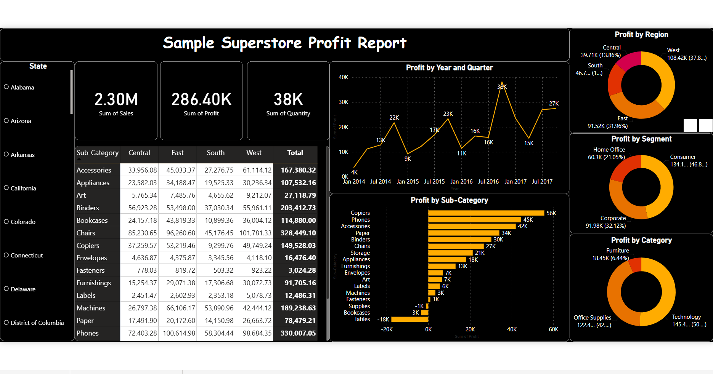

# Sample Superstore Sales Dashboard (Power BI)

## Project Overview
This project is an interactive Power BI dashboard built using the Sample Superstore dataset. The dashboard provides insights into sales performance, profit, customer segments, product categories, and regional performance.

## Dashboard Features
- Total Sales
- Total Profit
- Sales by Region
- Sales by Category
- Sales by Sub-Category
- Profit Analysis
- Customer Segment Analysis
- Interactive Filters (Slicers)

## Tools Used
- Power BI Desktop
- Power Query
- DAX
- Sample Superstore Dataset

## Dashboard Preview

## Live Dashboard
Power BI Service:
https://lnkd.in/dadNE5bV 

## Files
- Sample Superstore Dashboard.pbix
- Dashboard Screenshots

## Author
Najmudheen PK
